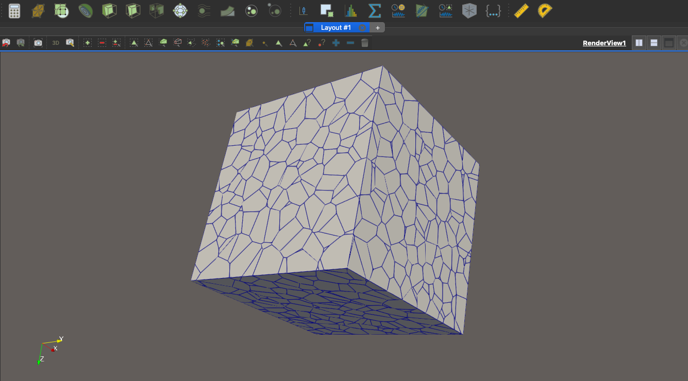

# **INMOST-VORO**



* **VoroLib** — a library with Voronoi-related utilities
* **Voro** — a command-line executable using the library
* **Benchmark** — a benchmark suite to measure performance and compare to voro++, veryfing the generated Voronoi diagrams match.  

---

## **Requirements**

* **C++ compiler** (GCC, Clang, or MSVC)
* **CMake ≥ 3.5**
* **INMOST library** installed on your system
  (and discoverable via `find_package(inmost REQUIRED)`)

---

## **Build Instructions**

### **0. Install INMOST**

Compile INMOST by using the guide from here: [https://github.com/INMOST-DEV/INMOST/wiki/0100-Compilation](https://github.com/INMOST-DEV/INMOST/wiki/0100-Compilation)

### **1. Clone the project**

```bash
git clone https://github.com/k0marov/INMOST-VORO.git
cd INMOST-VORO
```

### **2. Configure with CMake**

```bash
cmake -B build
```

If INMOST is installed in a custom location, set:

```bash
cmake -B build -DINMOST_DIR=/path/to/inmost
```

If you want to compile the Benchmark, set `-DBUILD_BENCHMARK=ON`. Because the benchmark compares performance and accuracy to `voro++`, this build option requires the [voro++ library](https://math.lbl.gov/voro++/) to be installed and discoverable through CMake. 

### **3. Build**

```bash
cmake --build build
```

This produces:

* `build/Voro` (the executable)
* `build/Benchmark` (if enabled, the benchmarking suite)
* `build/libVoroLib.a` or `libVoroLib.so` (depending on platform)

---

## **Example usage**

1. Use a helper script to generate a cloud of random seed points in with coords between 0 and 1:
```bash
python3 scripts/generate_random_points.py --num-points 1000 -o points_1000.txt
```
2. Run Voro to get a Voronoi tessellation with these points 
```bash
./build/Voro points_1000.txt
```
Run with `--direct-vtk` file to skip using INMOST and write to VTK directly
```bash
./build/Voro points_1000.txt --direct-vtk
```

Open output file `voronoi_output.vtk` in ParaView to view the tessellation.

## **Benchmarks**

For `Benchmark` binary to be compiled, `-DBUILD_BENCHMARK=ON` must be set. See more in the [Build Instructions](#2-configure-with-cmake) section.

A dedicated benchmark suite is included to compare the performance of:
1. **voro++**: The external command-line tool.
2. **voroqh**: The internal engine used by this project.
3. **INMOST Integration**: The full pipeline including INMOST cell creation.

### **Running the Benchmark**

After building, run:
```bash
./build/Benchmark
```

This will:
- Iterate through various input sizes (N=100 to N=3,000,000).
- Measure execution times for each component.
- Output results to `benchmark_results.csv`.

## voroqh

In `src/voroqh` directory there is the implemented algorithm for computing Voronoi diagram, including a modified QuickHull algorithm. 
More about it in [./src/voroqh/README.md](./src/voroqh/README.md).

## **Tests** 

- `Benchmark` includes tests along with the benchmark that compare the resulting Voronoi cells against voro++.
- voroqh has a full suite of independent tests for the algorithm. 
- The modified QuickHull algorithm is also tested in `quickhull/` directory. 
For info on running the voroqh tests, see [./src/voroqh/README.md](./src/voroqh/README.md).

The tests are also run on Github Actions for each pull request or push to `main` branch.